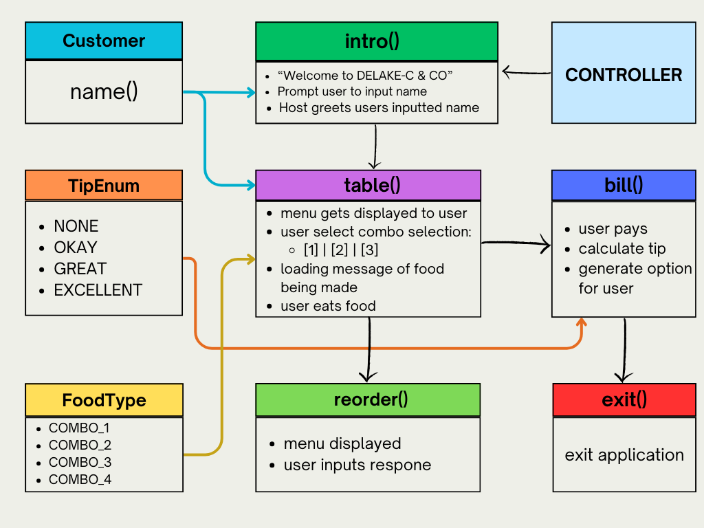
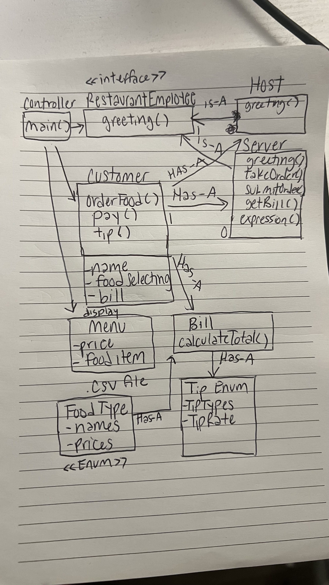
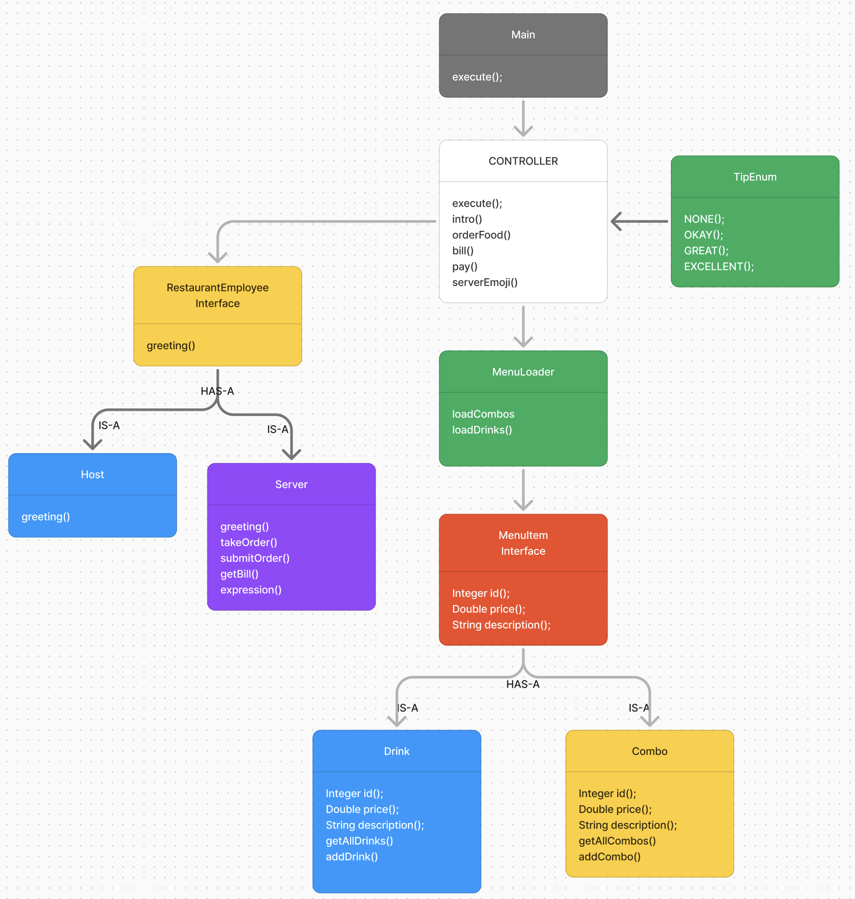
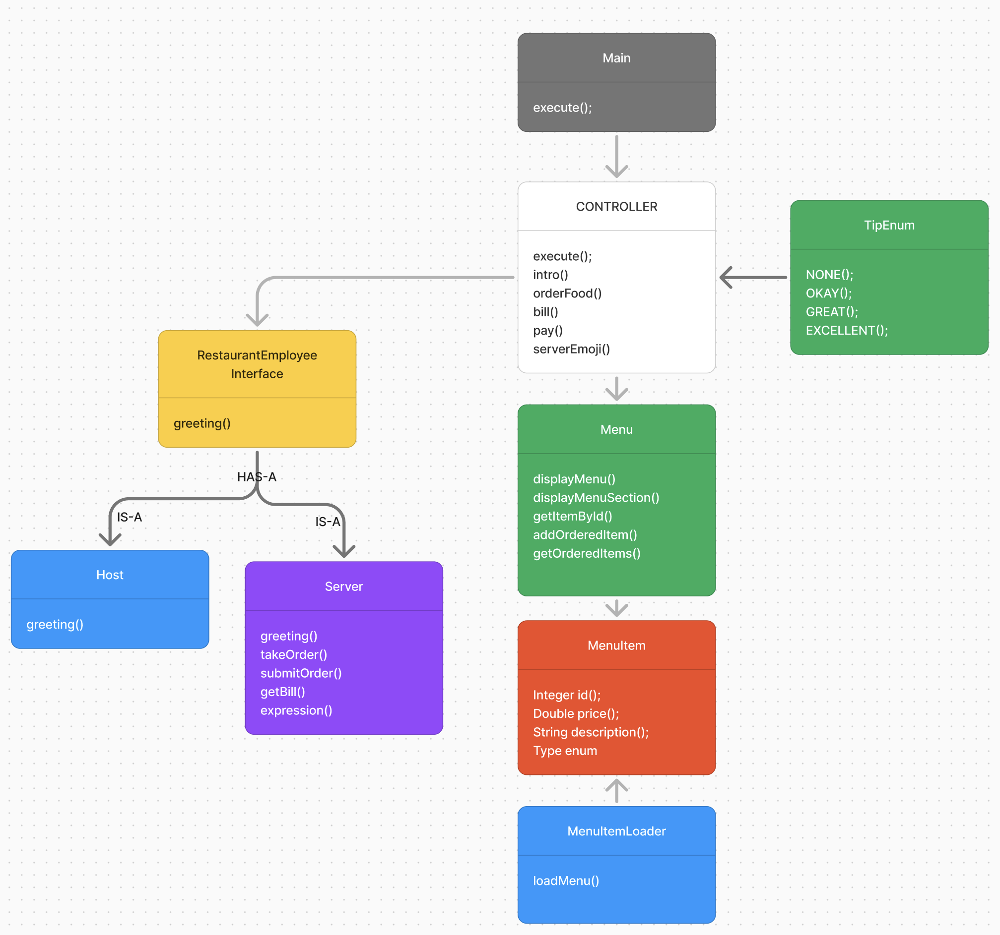

# *Seafood Delake-C & Co*

# The Roux Crew
### *Lakea Gray, Cortney Babb, DeShon Dixon*
---


## Project Description

### Summary
The dining experience begins when the customer is greeted by the host and seated at a table.
Shortly after, a server approaches to welcome the customer and address any questions about the menu.
The customer reviews the menu options.
Once ready, the ordering process takes place, with the customer selecting their desired items.
The meal is then prepared and served, allowing the customer to enjoy their food.
As the dining experience comes to a close, the server initiates the check-out process.
This includes presenting the bill, processing the payment,
providing a receipt, and allowing the customer to leave a tip.
Finally, the customer departs, concluding their visit to the restaurant.

- ### Restaurant Dining Process:

  - Host greets and seats the customer
  - Server greets the customer
  - Customer answers menu questions
  - Ordering a process
  - Meal consumption
  - Check and payment process

- ### Application Operation:
  - Welcome and Seating:
    - Host greets and seats the customer
    Menu is displayed


### Order Process:

- Combo Selection:

```
    Prompt user to enter a number for their choice

    Options:

    [1] Combo 1: 0.5lb Headless Shrimp, 0.5lb Crawfish
    [2] Combo 2: 0.5lb Headless Shrimp, 1 Cluster Snow Crab Legs
    [3] Combo 3: 0.5lb Headless Shrimp, 1lb King Crab
    [4] Combo 4: 1lb Headless Shrimp, 1 Cluster Crab Legs
    [5] Combo 5: 6oz Lobster Tail, 1 Cluster Crab Legs
```


- Drink Selection:

```
    Prompt user to enter a number for their choice

    Options:
    [1] Water
    [2] Soda
    [3] Beer
    [4] Mixed Drink
```

- ### Meal Service:

  - Server submits order to kitchen
  - Food is prepared and served
  - Customer eats

- ### Check-in and Checkout:

  - Server asks if everything is okay

```
    Prompt user: Ready to check out or order more?
```

- ### Payment Process:

  - If ready for check:
    - a. Present auto-generated tip options

    - b. Allow custom tip input
        Server reaction:

```
      If custom tip > [specified amount]: Server smiles

      If custom tip < [specified amount]: Server looks disappointed
```


- ### Conclusion:

  - Customer receives receipt
  - Customer leaves


---

### Flow Chart


--- 
### UML Diagram V1


### UML Diagram V2


### UML Diagram V3
